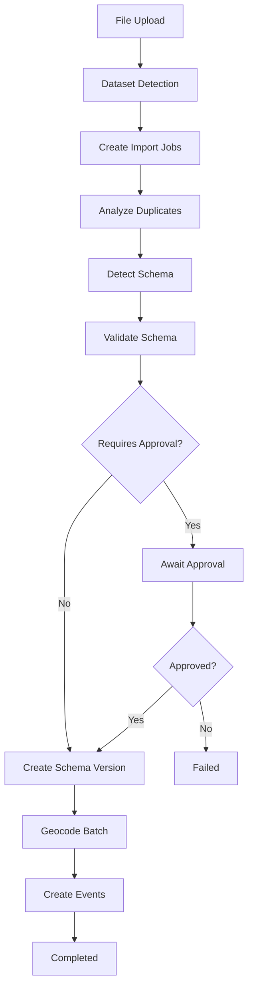

# Data Processing Pipeline

The TimeTiles data processing pipeline is a hook-driven, event-based system that transforms uploaded files into structured events. The pipeline automatically orchestrates a series of processing stages through Payload CMS collection hooks and background jobs.

## Quick Links

- **[Architecture & Design](./architecture)** - Design principles, core collections, and data flow
- **[Processing Stages](./stages)** - Detailed explanation of all 8 pipeline stages
- **[Configuration](./configuration)** - Dataset and system configuration options
- **[Troubleshooting](./troubleshooting)** - Common issues and debugging tools
- **[Best Practices](./best-practices)** - Guidelines for data providers and administrators

## Pipeline Overview

The pipeline processes data through eight sequential stages, from file upload to final event creation:

## Eight Processing Stages

1. **Dataset Detection** - Parse file structure and create import jobs (one per sheet for Excel files)
2. **Analyze Duplicates** - Identify internal and external duplicates before processing
3. **Detect Schema** - Build progressive schema from non-duplicate data
4. **Validate Schema** - Compare detected schema with existing dataset schema
5. **Manual Approval** (Optional) - Human review when changes require approval
6. **Create Schema Version** - Persist new schema version after approval
7. **Geocode Batch** - Enrich data with geographic coordinates
8. **Create Events** - Generate final event records with all enrichments

## Key Features

**Event-Driven Architecture**: Collection hooks automatically advance the pipeline through stages without manual intervention.

**Batch Processing**: Large files are processed in configurable batches to manage memory and respect API rate limits.

**Error Recovery**: Comprehensive error handling at both stage and batch levels, allowing recovery from partial failures.

**Schema Versioning**: Complete version history of all schema changes with audit trail.

**Multi-Sheet Support**: Excel files with multiple sheets create separate import jobs that process independently.

## Core Principles

- **Single Source of Truth**: Raw data files stay on disk; only processing state and results are stored in the database
- **File-Based Processing**: Data flows from file → memory → database, avoiding large data storage during processing
- **Metadata Tracking**: Processing state, schemas, duplicate maps, and geocoding results are persisted for resumable operations
- **Atomic Transitions**: StageTransitionService ensures exactly-once job execution with locking mechanisms

## Next Steps

New to the pipeline? Start with [Architecture & Design](./architecture) to understand the system's core principles.

Working on a specific stage? See [Processing Stages](./stages) for detailed documentation of each stage.

Need to configure behavior? Check [Configuration](./configuration) for dataset and system options.

Having issues? Visit [Troubleshooting](./troubleshooting) for common problems and solutions.
