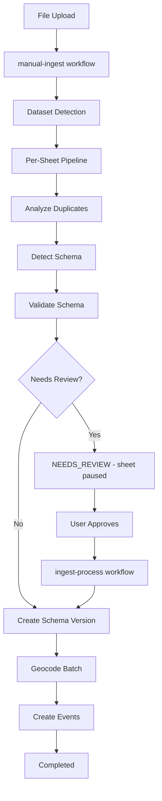

# Data Ingestion Pipeline

> **Terminology**: The ingestion pipeline is called "Import" in the UI and `import-*` in the codebase.

The TimeTiles data ingestion pipeline uses Payload CMS Workflows to transform uploaded files into structured events. Four workflows orchestrate task handlers into linear pipelines, with collection `afterChange` hooks triggering workflow execution.

## Quick Links

- **[Architecture & Design](./architecture)** - Design principles, core collections, and data flow
- **[Processing Stages](./stages)** - Detailed explanation of all 8 pipeline stages
- **[Configuration](./configuration)** - Dataset and system configuration options
- **[Troubleshooting](./troubleshooting)** - Common issues and debugging tools
- **[Best Practices](./best-practices)** - Guidelines for data providers and administrators

## Pipeline Overview

The pipeline uses 4 Payload Workflows, one per import type plus a post-review workflow:

```mermaid
graph TD
    A[File Upload] --> B[manual-ingest workflow]
    B --> C[Dataset Detection]
    C --> D[Per-Sheet Pipeline]
    D --> E[Analyze Duplicates]
    E --> F[Detect Schema]
    F --> G[Validate Schema]
    G --> H{Needs Review?}
    H -->|Yes| I[NEEDS_REVIEW - sheet paused]
    H -->|No| J[Create Schema Version]
    I --> K[User Approves]
    K --> L[ingest-process workflow]
    L --> J
    J --> M[Geocode Batch]
    M --> N[Create Events]
    N --> O[Completed]
```

## Four Workflows

| Workflow           | Trigger                                                       | Purpose                              |
| ------------------ | ------------------------------------------------------------- | ------------------------------------ |
| `manual-ingest`    | File upload (`ingest-files` afterChange hook)                 | Full pipeline for user uploads       |
| `scheduled-ingest` | `schedule-manager` job                                        | URL fetch + full pipeline            |
| `scraper-ingest`   | `schedule-manager` job                                        | Scraper execution + full pipeline    |
| `ingest-process`   | Approval of NEEDS_REVIEW job (`ingest-jobs` afterChange hook) | Resume after schema drift resolution |

## Per-Sheet Task Pipeline

Each sheet within a workflow runs through these tasks sequentially:

1. **Analyze Duplicates** - Identify internal and external duplicates before processing
2. **Detect Schema** - Build progressive schema from non-duplicate data
3. **Validate Schema** - Compare detected schema with existing dataset schema
4. **Create Schema Version** - Persist new schema version
5. **Geocode Batch** - Enrich data with geographic coordinates
6. **Create Events** - Generate final event records with all enrichments

Multi-sheet Excel files process all sheets within a single workflow instance. If one sheet fails or needs review, the remaining sheets continue processing.

## Key Features

**Workflow Orchestration**: Payload CMS Workflows define linear task pipelines with built-in retry and caching of completed tasks.

**Batch Processing**: Large files are processed in configurable batches to manage memory and respect API rate limits.

**Built-in Error Recovery**: Failed tasks are retried by Payload's workflow system. Completed tasks return cached output on retry, so work is never repeated.

**Schema Versioning**: Complete version history of all schema changes with audit trail.

**Multi-Sheet Support**: Excel files with multiple sheets are processed within a single workflow, with per-sheet failure isolation.

## Core Principles

- **Single Source of Truth**: Raw data files stay on disk; only processing state and results are stored in the database
- **File-Based Processing**: Data flows from file, to memory, to database, avoiding large data storage during processing
- **Metadata Tracking**: Processing state, schemas, duplicate maps, and geocoding results are persisted for resumable operations
- **Concurrency Control**: Per-resource concurrency keys prevent duplicate processing of the same file or scheduled import

## Next Steps

New to the pipeline? Start with [Architecture & Design](./architecture) to understand the system's core principles.

Working on a specific stage? See [Processing Stages](./stages) for detailed documentation of each stage.

Need to configure behavior? Check [Configuration](./configuration) for dataset and system options.

Having issues? Visit [Troubleshooting](./troubleshooting) for common problems and solutions.

Looking for the user-facing overview? See the [Data Ingestion guide](/user-guide/data-ingestion).
