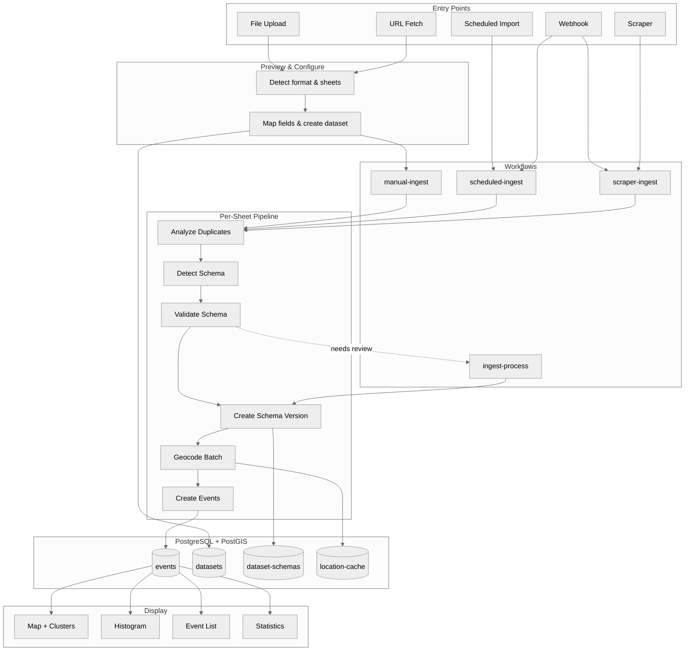
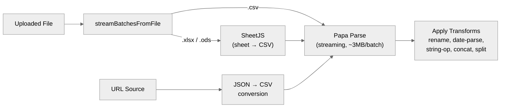
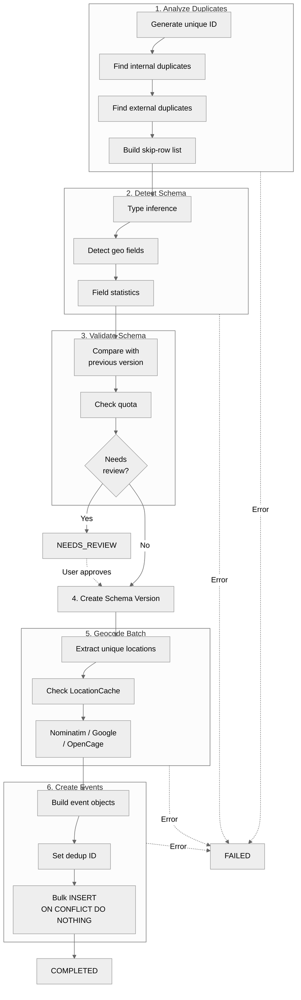
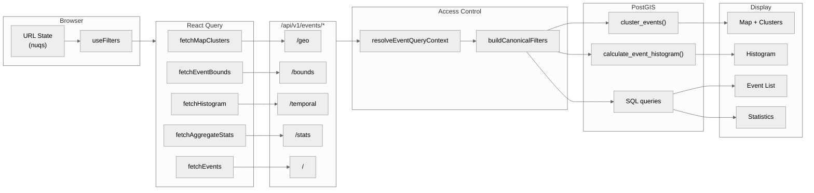
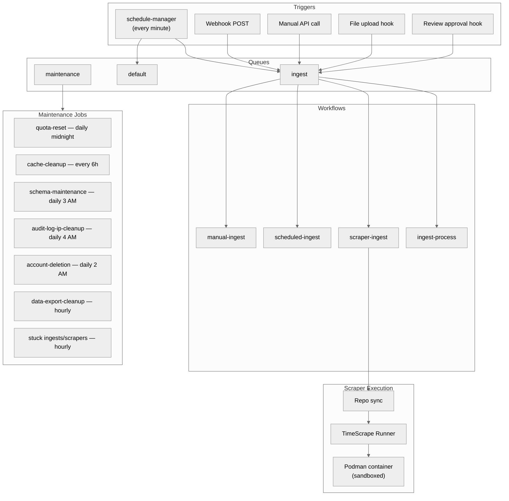
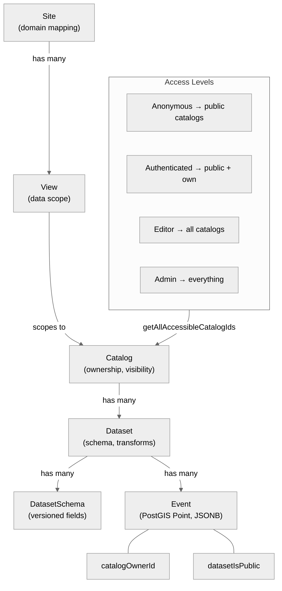

# Data Flow

How data enters, is processed, stored, queried, and displayed across TimeTiles.

## System Overview

End-to-end view from data entry through processing, storage, and display.

**Entry points:** Files (CSV, Excel, ODS) are uploaded directly. URLs and scrapers go through scheduled or manual triggers. Webhooks can trigger both scheduled imports and scraper runs.

**Workflows:** Four Payload Workflows on the `ingest` queue handle the different entry paths. All converge into the same 6-task per-sheet pipeline.

**Storage:** Events are stored with PostGIS Point geometry, JSONB original data, and denormalized access fields for zero-query permission checks.

---

## Import Pipeline Detail

The 6-task sheet processing pipeline. For stage-by-stage documentation, see [Processing Stages](/development/architecture/data-processing-pipeline/stages).

### File Reading

### Processing Pipeline

**Deduplication strategies:** `"external-id"` (field from source data), `"computed-hash"` (hash of title + date + location), `"content-hash"` (hash of entire row), `"hybrid"` (try external ID, fall back to computed hash).

**Review gate:** The pipeline pauses per-sheet (not per-file) when schema changes are breaking or when it's the first import. The `ingest-process` workflow resumes after user approval.

---

## Query & Display Flow

How data flows from PostgreSQL through the filter system to the frontend.

**Access control:** `resolveEventQueryContext` determines which catalogs the user can see (public + own for authenticated users). `buildCanonicalFilters` normalizes URL parameters into validated SQL conditions with field whitelisting against SQL injection.

**PostGIS functions:** `cluster_events()` does server-side spatial clustering by zoom level and bounds. `calculate_event_histogram()` computes time-bucketed event counts with automatic bucket sizing.

---

## Background Systems

Job queues, scheduling, scraper execution, and maintenance.

**Three queues:** `ingest` for import workflows (dedicated Docker worker in production), `default` for trigger jobs like `schedule-manager`, `maintenance` for periodic system tasks.

**Scraper isolation:** Scrapers run in rootless Podman containers with read-only filesystem, no network access, CPU/memory limits, and user namespace isolation. The TimeScrape runner (Hono API server) orchestrates execution.

---

## Data Organization & Access Control

Multi-tenant data model with denormalized access fields.

**Denormalized fields:** `catalogOwnerId` and `datasetIsPublic` are copied onto every event row. This enables zero-join access control — SQL queries filter directly on these fields instead of joining through catalog/dataset tables.

**Site & View resolution:** Cached with 5-minute TTL. Sites map domains to configurations. Views define which catalogs/datasets are visible (scopes: `all`, `catalogs`, or `datasets`).
