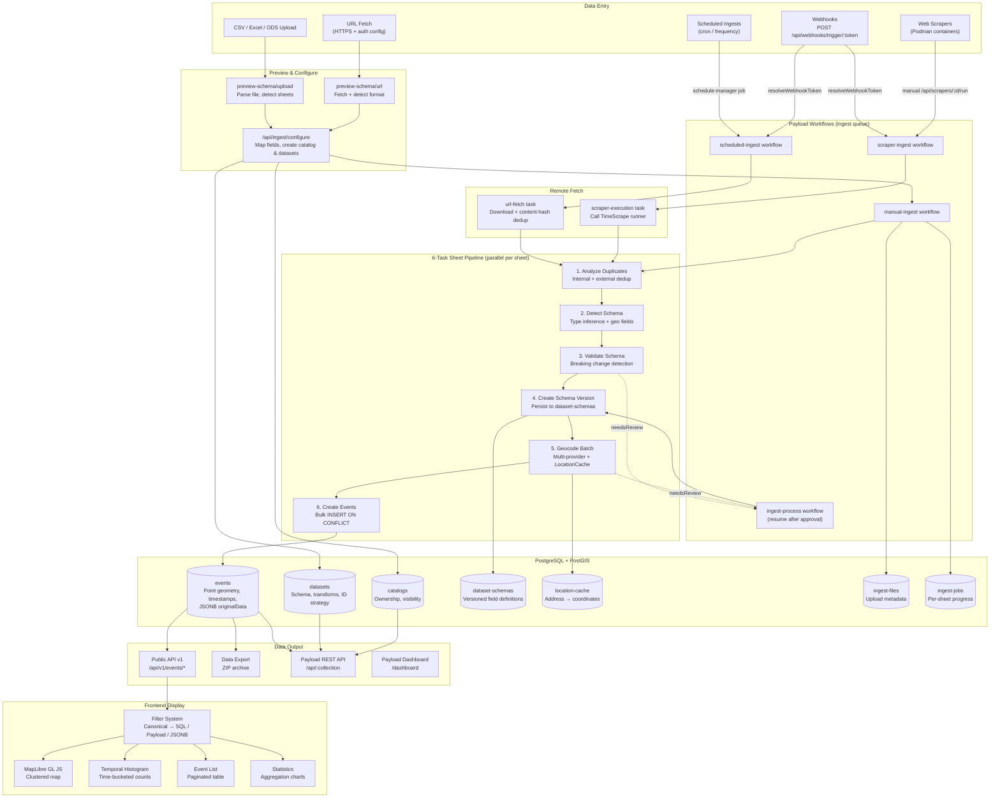
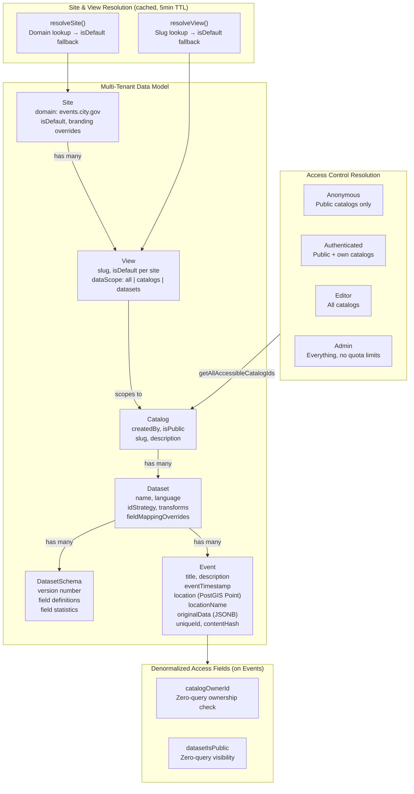

# Data Flow

Comprehensive diagrams showing how data enters, is processed, stored, queried, and displayed across the entire TimeTiles system.

## System Overview

End-to-end view of all entry points through processing, storage, and frontend output.

---

## Import Pipeline Detail

The 6-task sheet processing pipeline with file readers, transforms, and review loops. For stage-by-stage documentation, see [Processing Stages](./data-processing-pipeline/stages).

```mermaid
flowchart TD
    subgraph ENTRY["Entry Points"]
        E1["File Upload<br/>CSV / Excel / ODS / JSON"]
        E2["URL Fetch<br/>HTTPS + auth config"]
        E3["Scraper Output<br/>CSV from Podman"]
    end

    subgraph FILE_PROC["File Processing"]
        READER["streamBatchesFromFile<br/>Async generator"]
        PAPA["Papa Parse<br/>CSV streaming with backpressure<br/>~3MB memory per batch"]
        EXCEL["xlsx (SheetJS)<br/>Sheet → CSV sidecar conversion"]
        JSON_CSV["convertJsonToCsv<br/>JSON API → flat CSV"]
    end

    subgraph TRANSFORMS["Data Transforms (applied at each stage)"]
        TR_RENAME["rename — Move field path"]
        TR_DATE["date-parse — Parse date strings"]
        TR_STR["string-op — upper / lower / replace / expression"]
        TR_CONCAT["concatenate — Join fields"]
        TR_SPLIT["split — Split field by delimiter"]
    end

    subgraph DEDUP["Stage 1: Analyze Duplicates"]
        GEN_ID["generateUniqueId<br/>per dataset ID strategy"]
        INT_DUP["Internal duplicates<br/>Same unique ID within file"]
        EXT_DUP["External duplicates<br/>Query existing events by ID"]
        SKIP_LIST["Build skip-row list<br/>for later stages"]
    end

    subgraph SCHEMA_DET["Stage 2: Detect Schema"]
        PROG_BUILDER["ProgressiveSchemaBuilder<br/>Incremental type inference"]
        GEO_DETECT["detectFlatFieldMappings<br/>Find geocoding-capable fields"]
        FIELD_STATS["Field statistics<br/>Type distribution, nullability"]
    end

    subgraph SCHEMA_VAL["Stage 3: Validate Schema"]
        COMPARE["Compare with latest version<br/>Breaking vs non-breaking changes"]
        QUOTA_CHECK["Check event quota<br/>Would import exceed limits?"]
        REVIEW_GATE{"Needs<br/>Review?"}
    end

    subgraph SCHEMA_VER["Stage 4: Create Schema Version"]
        NEW_VER["Create dataset-schemas record<br/>Increment version number"]
    end

    subgraph GEOCODE["Stage 5: Geocode Batch"]
        EXTRACT_LOC["Extract unique locations<br/>normalizeGeocodingAddress"]
        CACHE_CHECK["Check LocationCache<br/>Skip already-geocoded"]
        PROVIDERS["Multi-provider geocoding<br/>Nominatim / Google / OpenCage"]
        RESULT_MAP["Store results map<br/>address → lat, lng, confidence"]
    end

    subgraph CREATE["Stage 6: Create Events"]
        BUILD_EVENT["createEventData<br/>Transform row → event object"]
        LOOKUP_GEO["Look up geocoding results<br/>from results map"]
        DEDUP_ID["Generate deduplication ID"]
        DENORM["Denormalize access fields<br/>isPublic, catalogOwnerId"]
        BULK_INSERT["bulkInsertEvents<br/>INSERT ... ON CONFLICT DO NOTHING"]
    end

    subgraph OUTCOME["Outcomes"]
        COMPLETED["COMPLETED<br/>Events in database"]
        NEEDS_REVIEW["NEEDS_REVIEW<br/>Awaiting user approval"]
        FAILED["FAILED<br/>Error logged to ingest-jobs"]
    end

    E1 --> READER
    E2 --> READER
    E3 --> READER
    E1 -.->|"JSON API"| JSON_CSV --> READER
    READER -->|".csv"| PAPA
    READER -->|".xlsx / .ods"| EXCEL --> PAPA

    PAPA --> TRANSFORMS
    TRANSFORMS --> DEDUP

    DEDUP --> GEN_ID --> INT_DUP --> EXT_DUP --> SKIP_LIST

    SKIP_LIST --> SCHEMA_DET
    SCHEMA_DET --> PROG_BUILDER --> GEO_DETECT --> FIELD_STATS

    FIELD_STATS --> SCHEMA_VAL
    SCHEMA_VAL --> COMPARE --> QUOTA_CHECK --> REVIEW_GATE
    REVIEW_GATE -->|"Yes"| NEEDS_REVIEW
    REVIEW_GATE -->|"No"| SCHEMA_VER
    NEEDS_REVIEW -->|"User approves"| SCHEMA_VER

    SCHEMA_VER --> NEW_VER

    NEW_VER --> GEOCODE
    GEOCODE --> EXTRACT_LOC --> CACHE_CHECK --> PROVIDERS --> RESULT_MAP

    RESULT_MAP --> CREATE
    CREATE --> BUILD_EVENT --> LOOKUP_GEO --> DEDUP_ID --> DENORM --> BULK_INSERT

    BULK_INSERT --> COMPLETED
    DEDUP -.->|"Error"| FAILED
    SCHEMA_DET -.->|"Error"| FAILED
    GEOCODE -.->|"Error"| FAILED
    CREATE -.->|"Error"| FAILED
```

---

## Query & Display Flow

How data flows from the database through filters, APIs, and React Query hooks to MapLibre and the UI.

```mermaid
flowchart LR
    subgraph USER["User Interaction"]
        BROWSER["Browser"]
        URL_STATE["URL State via nuqs<br/>?catalog=5&startDate=...&bounds=..."]
    end

    subgraph HOOKS["React Query Hooks"]
        USE_FILTERS["useFilters<br/>URL-synced filter state"]
        USE_EVENTS["useEventsQueries"]
        FETCH_CLUSTERS["fetchMapClusters"]
        FETCH_BOUNDS["fetchEventBounds"]
        FETCH_HIST["fetchHistogram"]
        FETCH_STATS["fetchAggregateStats"]
        FETCH_LIST["fetchEventsInternal"]
        FETCH_CLUSTER_STATS["fetchClusterStats"]
    end

    subgraph API["API Layer — /api/v1/events/*"]
        ROUTE_GEO["GET /events/geo<br/>Map clusters"]
        ROUTE_BOUNDS["GET /events/bounds<br/>Fit bounds"]
        ROUTE_TEMPORAL["GET /events/temporal<br/>Histogram buckets"]
        ROUTE_STATS["GET /events/stats<br/>Aggregation"]
        ROUTE_LIST["GET /events<br/>Paginated list"]
        ROUTE_GEO_STATS["GET /events/geo/stats<br/>Cluster percentiles"]
    end

    subgraph ACCESS["Access Control"]
        RESOLVE["resolveEventQueryContext"]
        CATALOG_IDS["getAllAccessibleCatalogIds<br/>Public + user-owned catalogs"]
        VIEW_SCOPE["View data scope<br/>all / catalogs / datasets"]
    end

    subgraph FILTER_SYS["Filter System"]
        CANONICAL["buildCanonicalFilters<br/>Normalize + validate + access-check"]
        ADAPT_SQL["toSqlConditions<br/>Raw SQL WHERE clauses"]
        ADAPT_PAYLOAD["toPayloadWhere<br/>Payload CMS Where syntax"]
        ADAPT_JSONB["toClusteringJsonb<br/>toHistogramJsonb<br/>PG function parameters"]
        FIELD_VAL["fieldValidation<br/>Whitelist + SQL injection prevention"]
    end

    subgraph POSTGIS["PostgreSQL + PostGIS"]
        CLUSTER_FN["cluster_events()<br/>Server-side spatial clustering<br/>by zoom level + bounds"]
        HISTOGRAM_FN["calculate_event_histogram()<br/>Time-bucketed event counts<br/>auto bucket sizing"]
        BOUNDS_SQL["MIN/MAX lat/lng + COUNT(*)"]
        AGG_SQL["GROUP BY catalog/dataset COUNT(*)"]
        PERCENTILE["PERCENTILE_CONT<br/>p20 / p40 / p60 / p80 / p100"]
        EVENTS_TBL[("events table<br/>PostGIS Point geometry<br/>JSONB originalData<br/>Denormalized access fields")]
    end

    subgraph RENDER["Frontend Rendering"]
        CLUSTERED_MAP["ClusteredMap<br/>react-map-gl + MapLibre"]
        CLUSTER_LAYER["Cluster circles<br/>Sized by count<br/>Colored by percentile"]
        POINT_LAYER["Event points<br/>Individual markers"]
        HIST_CHART["Temporal Histogram<br/>Time-series bar chart"]
        AGG_CHART["Aggregation Chart<br/>Bar chart by catalog/dataset"]
        EVENT_LIST["Event List<br/>Paginated table view"]
        POPUP["Map Popup<br/>Event detail on click"]
        VIEWPORT_STATS["Viewport Stats<br/>Real-time aggregation"]
    end

    BROWSER --> URL_STATE --> USE_FILTERS
    USE_FILTERS --> USE_EVENTS
    USE_EVENTS --> FETCH_CLUSTERS & FETCH_BOUNDS & FETCH_HIST & FETCH_STATS & FETCH_LIST & FETCH_CLUSTER_STATS

    FETCH_CLUSTERS --> ROUTE_GEO
    FETCH_BOUNDS --> ROUTE_BOUNDS
    FETCH_HIST --> ROUTE_TEMPORAL
    FETCH_STATS --> ROUTE_STATS
    FETCH_LIST --> ROUTE_LIST
    FETCH_CLUSTER_STATS --> ROUTE_GEO_STATS

    ROUTE_GEO & ROUTE_BOUNDS & ROUTE_TEMPORAL & ROUTE_STATS & ROUTE_LIST & ROUTE_GEO_STATS --> RESOLVE
    RESOLVE --> CATALOG_IDS
    RESOLVE --> VIEW_SCOPE

    CATALOG_IDS --> CANONICAL
    VIEW_SCOPE --> CANONICAL
    CANONICAL --> FIELD_VAL
    CANONICAL --> ADAPT_SQL & ADAPT_JSONB & ADAPT_PAYLOAD

    ADAPT_JSONB --> CLUSTER_FN
    ADAPT_JSONB --> HISTOGRAM_FN
    ADAPT_SQL --> BOUNDS_SQL
    ADAPT_SQL --> AGG_SQL
    ADAPT_SQL --> PERCENTILE
    CLUSTER_FN --> EVENTS_TBL
    HISTOGRAM_FN --> EVENTS_TBL
    BOUNDS_SQL --> EVENTS_TBL
    AGG_SQL --> EVENTS_TBL
    PERCENTILE --> EVENTS_TBL

    CLUSTER_FN --> CLUSTERED_MAP
    CLUSTERED_MAP --> CLUSTER_LAYER & POINT_LAYER & POPUP & VIEWPORT_STATS
    HISTOGRAM_FN --> HIST_CHART
    AGG_SQL --> AGG_CHART
    BOUNDS_SQL --> CLUSTERED_MAP
    PERCENTILE --> CLUSTER_LAYER
    ADAPT_PAYLOAD --> EVENT_LIST
```

---

## Background Systems & Scheduling

Job queues, cron scheduling, scraper execution in Podman, maintenance jobs, and cross-cutting services.

```mermaid
flowchart TB
    subgraph TRIGGERS["Trigger Sources"]
        CRON_TICK["schedule-manager job<br/>(runs every minute)"]
        WEBHOOK_POST["POST /api/webhooks/trigger/:token<br/>Dual-window rate limit:<br/>1 per 10s burst, 5/hour"]
        MANUAL_API["POST /api/scrapers/:id/run<br/>POST /api/scheduled-ingests/:id/trigger"]
        FILE_HOOK["ingest-files afterChange hook<br/>(new file uploaded)"]
        JOB_HOOK["ingest-jobs afterChange hook<br/>(review approved)"]
        ADMIN_API["POST /api/admin/jobs/run<br/>Manual job trigger"]
    end

    subgraph SCHEDULING["Schedule Resolution"]
        FIND_DUE["Find enabled schedules<br/>WHERE nextRun <= NOW"]
        FREQ_CALC["Frequency calculation<br/>hourly / daily / weekly / monthly"]
        CRON_CALC["Cron expression parsing<br/>with timezone support"]
        ATOMIC_CLAIM["Atomic status claim<br/>UPDATE SET status = 'running'<br/>WHERE status != 'running'"]
    end

    subgraph QUEUES["Job Queues (Payload Jobs)"]
        Q_INGEST["ingest queue<br/>Import workflows"]
        Q_DEFAULT["default queue<br/>Trigger jobs"]
        Q_MAINT["maintenance queue<br/>System jobs"]
    end

    subgraph INGEST_WORKFLOWS["Ingest Workflows"]
        WF1["manual-ingest<br/>File → detect → 6-task pipeline"]
        WF2["scheduled-ingest<br/>URL fetch → detect → pipeline"]
        WF3["scraper-ingest<br/>Podman exec → detect → pipeline"]
        WF4["ingest-process<br/>Resume after review approval"]
    end

    subgraph SCRAPER_SYS["Scraper Execution"]
        REPO_SYNC["scraper-repo-sync<br/>Git clone / manifest parse"]
        EXEC_TASK["scraper-execution task"]
        TIMESCRAPE["TimeScrape Runner<br/>(Hono API server)"]
        PODMAN["Podman Container<br/>Read-only FS, no network<br/>CPU/memory limits<br/>User namespace isolation"]
        OUTPUT_CSV["Output CSV<br/>Validated + row-counted"]
    end

    subgraph MAINTENANCE["Maintenance Jobs"]
        QUOTA_RESET["quota-reset<br/>Daily midnight UTC<br/>Reset daily counters"]
        CACHE_CLEAN["cache-cleanup<br/>Every 6 hours<br/>Clear stale caches"]
        SCHEMA_MAINT["schema-maintenance<br/>Daily 3:00 AM<br/>Prune unused versions"]
        IP_CLEANUP["audit-log-ip-cleanup<br/>Daily 4:00 AM<br/>Clear IPs > 30 days"]
        ACCT_DELETE["execute-account-deletion<br/>Daily 2:00 AM<br/>Purge after grace period"]
        EXPORT_CLEAN["data-export-cleanup<br/>Hourly<br/>Delete expired ZIPs"]
        STUCK_SCHED["cleanup-stuck-scheduled-ingests<br/>Reset stalled imports"]
        STUCK_SCRAPER["cleanup-stuck-scrapers<br/>Reset stalled runs"]
    end

    subgraph SERVICES["Cross-Cutting Services"]
        QUOTA_SVC["QuotaService<br/>Check + increment usage<br/>Trust level enforcement"]
        AUDIT_SVC["AuditLogService<br/>26 action types, 6 domains<br/>PII hashing, IP retention"]
        EMAIL_SVC["Email Service<br/>i18n templates (en/de)<br/>Non-throwing delivery"]
        RATE_LIMIT["RateLimitService<br/>In-memory, per-IP<br/>Sliding window"]
        GEOCODE_SVC["GeocodingService<br/>Multi-provider<br/>Nominatim / Google / OpenCage"]
        WEBHOOK_REG["WebhookRegistry<br/>Token generation/resolution<br/>Concurrency prevention"]
    end

    subgraph EMAILS["Email Triggers"]
        E_REG["Registration<br/>Anti-enumeration"]
        E_EMAIL["Email change<br/>Old + new notifications"]
        E_PWD["Password change<br/>Confirmation"]
        E_DEL_SCHED["Deletion scheduled<br/>Grace period + cancel link"]
        E_DEL_DONE["Deletion completed<br/>Final notice"]
        E_EXPORT["Export ready<br/>Download link + expiry"]
        E_IMPORT["Import complete/failed<br/>Status notification"]
    end

    CRON_TICK --> FIND_DUE
    FIND_DUE --> FREQ_CALC & CRON_CALC
    FREQ_CALC & CRON_CALC --> ATOMIC_CLAIM

    ATOMIC_CLAIM --> Q_INGEST
    WEBHOOK_POST --> WEBHOOK_REG --> ATOMIC_CLAIM
    MANUAL_API --> Q_INGEST
    FILE_HOOK --> Q_INGEST
    JOB_HOOK --> Q_INGEST
    ADMIN_API --> Q_DEFAULT

    Q_INGEST --> WF1 & WF2 & WF3 & WF4
    Q_MAINT --> MAINTENANCE

    WF3 --> EXEC_TASK --> TIMESCRAPE --> PODMAN --> OUTPUT_CSV
    OUTPUT_CSV -->|"autoImport"| WF1
    REPO_SYNC --> TIMESCRAPE

    WF1 & WF2 & WF3 --> QUOTA_SVC
    WF1 & WF2 & WF3 --> AUDIT_SVC
    WF1 & WF2 & WF3 --> GEOCODE_SVC
    WEBHOOK_POST --> RATE_LIMIT
    ACCT_DELETE --> EMAIL_SVC
    EMAIL_SVC --> E_REG & E_EMAIL & E_PWD & E_DEL_SCHED & E_DEL_DONE & E_EXPORT & E_IMPORT
```

---

## Data Organization & Access Control

Multi-tenant data model with denormalized access fields for zero-query permission checks.

