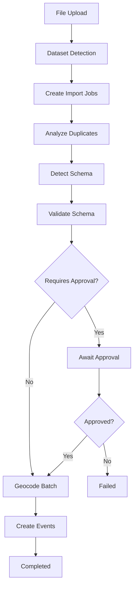

# Data Processing Pipeline

The TimeTiles data processing pipeline is a hook-driven, event-based system that transforms uploaded files into structured events. The pipeline automatically orchestrates a series of processing stages through Payload CMS collection hooks and background jobs.

## Architecture Overview

The pipeline follows a **single source of truth** principle where:

- **Files stay on disk**: Raw data is never stored in the database during processing
- **Metadata in database**: Only processing state, progress, and results are tracked
- **Event-driven flow**: Collection hooks automatically advance the pipeline
- **Batch processing**: Large files are processed in manageable chunks

### Core Collections

The pipeline uses four main collections that work together:

1. **`import-files`** - File upload and metadata storage
2. **`import-jobs`** - Processing state and orchestration
3. **`datasets`** - Configuration and schema management
4. **`events`** - Final processed data storage

## Processing Flow



## Processing Stages

### 1. File Upload & Dataset Detection

**Trigger**: File uploaded to `import-files` collection  
**Handler**: `dataset-detection-job`  
**Purpose**: Parse file structure and create import jobs

When a file is uploaded:

1. File is stored on disk in the `import-files` directory
2. `afterChange` hook in `import-files` triggers dataset detection
3. For Excel files: Each sheet becomes a separate import job
4. For CSV files: Single import job is created
5. Jobs are linked to appropriate datasets (auto-created if needed)

```typescript
// Multiple import jobs can be created from a single file
File: "events_2024.xlsx"
├── Sheet "Conferences" → Import Job #1 → Dataset "conferences"
├── Sheet "Workshops" → Import Job #2 → Dataset "workshops"
└── Sheet "Meetings" → Import Job #3 → Dataset "meetings"
```

### 2. Duplicate Analysis

**Stage**: `analyze-duplicates`  
**Handler**: `analyze-duplicates-job`  
**Purpose**: Identify internal and external duplicates early in the process

The system analyzes the entire file to build a duplicate map before processing:

**Internal Duplicates**: Rows within the same import that are duplicates of each other
**External Duplicates**: Rows that match existing events in the database

```typescript
// Duplicate detection strategies (configured per dataset)
- external-id: Use specific field (e.g., "id", "uuid")
- computed-hash: Hash specific fields (e.g., "name + date + location")
- content-hash: Hash entire row content
- hybrid: Try external ID first, fallback to computed hash
```

**Benefits of early duplicate analysis**:

- Reduces processing volume for subsequent stages
- Avoids unnecessary geocoding API calls
- Prevents creation of duplicate events

### 3. Schema Detection

**Stage**: `detect-schema`  
**Handler**: `schema-detection-job`  
**Purpose**: Build a progressive schema from non-duplicate data

The schema detection runs in batches, progressively building understanding of the data:

**What it detects**:

- Field types (string, number, date, boolean)
- Required vs optional fields
- Field statistics (min/max values, unique counts)
- Geocoding candidates (address, latitude/longitude fields)

**Progressive building**: Each batch refines the schema, handling type conflicts and null values intelligently.

### 4. Schema Validation

**Stage**: `validate-schema`  
**Handler**: `validate-schema-job`  
**Purpose**: Compare detected schema with existing dataset schema

The validator compares the new schema against the current dataset schema:

**Breaking changes** (require approval):

- Field type changes (string → number)
- Removed required fields
- Incompatible format changes

**Non-breaking changes** (can be auto-approved):

- New optional fields
- Expanded field constraints
- Additional enum values

**Auto-approval conditions**:

- Dataset has `autoGrow` enabled
- No breaking changes detected
- Dataset not locked for changes

### 5. Manual Approval (Optional)

**Stage**: `await-approval`  
**Purpose**: Human review of schema changes

When changes require approval:

- Import pauses at this stage
- Notification sent to dataset administrators
- Approval/rejection updates the import job
- Approved changes create new schema version

### 6. Geocoding

**Stage**: `geocode-batch`  
**Handler**: `geocode-batch-job`  
**Purpose**: Enrich data with geographic coordinates

**Address geocoding**: Convert address strings to lat/lng coordinates
**Coordinate validation**: Validate provided latitude/longitude pairs
**Rate limiting**: Respects external API limits with small batch sizes

Geocoding happens **before** event creation so location data is available immediately.

### 7. Event Creation

**Stage**: `create-events`  
**Handler**: `create-events-batch-job`  
**Purpose**: Create final event records with all enrichments

For each non-duplicate row:

1. Generate unique ID using dataset strategy
2. Apply geocoding results if available
3. Extract timestamp and location display
4. Create event with complete data

**Error handling**: Individual row failures don't stop the batch, errors are logged per row.

## Pipeline Orchestration

### Hook-Driven Architecture

The pipeline uses Payload CMS collection hooks for automatic orchestration:

```typescript
// import-jobs collection afterChange hook
export const advanceToNextStage = async ({ doc, previousDoc, req }) => {
  // Only trigger on stage changes
  if (doc.stage === previousDoc?.stage) return;

  switch (doc.stage) {
    case "detect-schema":
      await req.payload.jobs.queue({
        task: "detect-schema",
        input: { importJobId: doc.id, batchNumber: 0 },
      });
      break;
    // ... other stages
  }
};
```

### Batch Processing

Large files are processed in configurable batches:

```typescript
export const BATCH_SIZES = {
  DUPLICATE_ANALYSIS: 5000, // Memory efficient
  SCHEMA_DETECTION: 10000, // Larger for efficiency
  GEOCODING: 100, // Small for API limits
  EVENT_CREATION: 1000, // Avoid transaction timeouts
};
```

### Error Recovery

The system includes comprehensive error handling:

**Stage-level failures**: Mark import job as failed, preserve partial progress
**Row-level failures**: Log errors but continue processing other rows
**Retry mechanisms**: Built-in retry logic for transient failures
**Manual recovery**: Administrators can resume from last successful stage

## Data Flow Principles

### File-Based Processing

```typescript
// Data flows from file → memory → database
const rows = await readBatchFromFile(filePath, {
  sheetIndex: job.sheetIndex,
  startRow: batchNumber * BATCH_SIZE,
  limit: BATCH_SIZE,
});

// Process in memory
const processedRows = await transformRows(rows);

// Only final results stored in database
await createEvents(processedRows);
```

### Metadata Tracking

Throughout processing, only metadata is stored:

```typescript
{
  stage: "geocode-batch",
  progress: { current: 1500, total: 10000 },
  duplicates: {
    internal: [/* row numbers */],
    external: [/* row numbers */],
    summary: { totalRows: 10000, uniqueRows: 8500 }
  },
  geocodingResults: {
    "42": { coordinates: { lat: 40.7128, lng: -74.0060 } }
    // Key = row number, Value = geocoding result
  }
}
```

### Version Tracking

Payload's built-in versioning tracks the complete pipeline progression:

- Each stage change creates a new version
- Full audit trail of processing decisions
- Ability to analyze bottlenecks and failures
- Recovery information for debugging

## Performance Characteristics

### Scalability

- **Memory efficient**: Batch processing prevents memory exhaustion
- **Database friendly**: Minimal database writes during processing
- **API respectful**: Geocoding respects rate limits
- **Parallelizable**: Multiple import jobs can run concurrently

### Monitoring

The pipeline provides extensive monitoring capabilities:

- **Progress tracking**: Real-time progress for each stage
- **Performance metrics**: Processing times and throughput
- **Error logging**: Detailed error information per row/batch
- **Resource usage**: Memory and API quota consumption

## Configuration

### Dataset Configuration

Each dataset can configure its processing behavior:

```typescript
{
  // ID Strategy - How to identify unique events
  idStrategy: {
    type: "external",        // external, computed, auto, hybrid
    externalIdPath: "id",    // Path to ID field in data
    computedIdFields: [      // Fields to hash for computed ID
      { fieldPath: "name" },
      { fieldPath: "date" }
    ],
    duplicateStrategy: "skip" // skip, update, version
  },

  // Deduplication configuration
  deduplicationConfig: {
    enabled: true,
    strategy: "external-id"  // external-id, computed-hash, content-hash, hybrid
  },

  // Schema behavior
  schemaConfig: {
    locked: false,             // Require approval for ALL changes
    autoGrow: true,            // Auto-approve safe changes
    strictValidation: false,   // Block import on validation failures
    allowTransformations: true,// Enable type transformations
    maxSchemaDepth: 3,        // Max nesting depth
    autoApproveNonBreaking: true
  },

  // Type transformations
  typeTransformations: [
    {
      fieldPath: "temperature",
      fromType: "string",
      toType: "number",
      transformStrategy: "parse", // parse, cast, custom, reject
      enabled: true
    }
  ],

  // Enum detection
  enumDetection: {
    mode: "count",      // count or percentage
    threshold: 50       // Max values or percentage
  },

  // Geographic detection
  geoFieldDetection: {
    autoDetect: true,
    latitudePath: null,  // Auto-detected or manual override
    longitudePath: null
  },

  // Processing limits
  maxConcurrentJobs: 3,
  processingTimeout: 3600000 // 1 hour
}
```

### System Configuration

Global pipeline settings:

```typescript
{
  maxFileSize: 100 * 1024 * 1024, // 100MB
  supportedFormats: [".csv", ".xlsx", ".xls"],
  maxConcurrentImports: 10,
  retryAttempts: 3,
  retryBackoff: "exponential"
}
```

## Best Practices

### For Data Providers

1. **Consistent Structure**: Keep your data structure consistent across imports
2. **Meaningful Field Names**: Use descriptive field names that make sense to users
3. **Include IDs**: Provide unique identifiers when possible to enable efficient deduplication
4. **Type Consistency**: Keep field types consistent to avoid transformation overhead
5. **Geographic Data**: Use standard field names like `latitude`, `longitude`, `address` for auto-detection

### For System Administrators

1. **Monitor Schema Changes**: Check pending approvals after imports regularly
2. **Configure Transformations**: Set up rules for known type mismatches to reduce manual intervention
3. **Monitor Field Growth**: Watch for excessive field proliferation that may impact performance
4. **Document Decisions**: Note why certain schema changes were approved/rejected
5. **Set Appropriate Batch Sizes**: Tune batch sizes based on your system's memory and performance characteristics

### For Large Datasets

1. **Monitor Field Count**: Datasets with >1000 fields may impact performance
2. **Set Appropriate Thresholds**: Configure enum detection thresholds for your data patterns
3. **Use Progressive Import**: Let schema build incrementally for large files rather than forcing immediate completion
4. **Plan for Geocoding**: Large address datasets should account for API rate limits and costs
5. **Consider Partitioning**: Very large datasets may benefit from splitting across multiple imports

## Troubleshooting

### Common Issues

**Import stuck in processing**:

- Check job queue status and error logs
- Verify all required services are running
- Look for memory or disk space issues
- Check for database connection problems

**Schema approval needed**:

- Review breaking changes in the admin interface
- Check if dataset has `locked` schema configuration
- Verify user permissions for schema approval
- Consider enabling `autoGrow` for non-breaking changes

**Duplicate events appearing**:

- Check your ID strategy configuration (external vs computed vs auto)
- Verify external ID path is correct for your data structure
- For computed IDs, ensure selected fields create unique combinations
- Check duplicate handling strategy (skip/update/version)
- Review import logs for duplicate detection details

**Geocoding failures**:

- Verify API keys are configured and valid
- Check rate limit status and quotas
- Ensure address data is properly formatted
- Review geocoding candidate detection results
- Consider manual field mapping if auto-detection fails

**Schema conflicts**:

- Check pending schemas in the admin panel
- Configure type transformations for known mismatches
- Review schema history in dataset-schemas collection
- Use auto-grow for safe changes only
- Check import logs for transformation details

**Memory issues**:

- Reduce batch sizes for very large files
- Monitor system memory usage during imports
- Consider processing files in smaller chunks
- Check for memory leaks in custom transformation functions

**Performance degradation**:

- Monitor batch processing times
- Check database query performance
- Review geocoding API response times
- Consider scaling background job workers
- Optimize schema depth and field counts

### Debugging Tools

**Version history**: Review processing progression through import job versions
**Error logs**: Detailed per-row error information in import job records
**Performance metrics**: Processing times and throughput logged per stage
**Manual intervention**: Resume processing from any stage using admin interface
**Database queries**: Direct inspection of import-jobs collection for detailed state

### Recovery Procedures

**Stage-level recovery**:

1. Identify last successful stage from import job record
2. Reset stage to previous successful state
3. Queue appropriate job to resume processing
4. Monitor for successful completion

**Batch-level recovery**:

1. Check progress.current vs progress.total
2. Resume from last processed batch number
3. Verify data integrity of partial results
4. Continue processing from interruption point

**Complete restart**:

1. Mark current import job as failed
2. Create new import job from same file
3. Apply lessons learned from failure analysis
4. Monitor new import for successful completion

This pipeline design provides a robust, scalable, and maintainable approach to data processing while leveraging Payload CMS's built-in capabilities for orchestration and state management.
