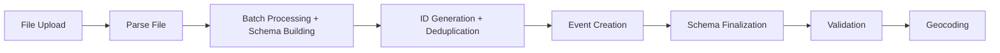

# Schema Detection & Management

TimeTiles automatically detects the structure of your imported data progressively during imports, preventing duplicates and handling schema changes intelligently with editor approval workflows. Detected schemas are then used to generate dynamic filters automatically.

## Overview

When you import data into TimeTiles, the system:

1. **Progressively builds** the schema during import without blocking
2. **Prevents duplicates** using configurable ID strategies
3. **Detects** field types, geographic coordinates, and patterns
4. **Transforms** data types automatically when mismatches occur
5. **Requires approval** for breaking changes while auto-approving safe changes
6. **Stores** complete version history using Payload's versioning

## Key Features

### Progressive Schema Detection

The system builds schemas progressively as data is imported:

- **Non-blocking**: Schema detection happens alongside import, not after
- **Type detection**: Identifies string, number, boolean, date, array, object, and mixed types
- **Format detection**: Recognizes emails, URLs, dates, and numeric strings
- **Geographic detection**: Automatically finds latitude/longitude fields
- **Enum detection**: Identifies fields with limited values (configurable threshold)
- **Conflict tracking**: Records type conflicts for manual resolution

### Smart Deduplication

Duplicates are detected and prevented from being saved to the database:

- **External ID**: Use an ID from your source system (e.g., `data.id`)
- **Computed Hash**: Calculate unique ID from multiple fields
- **Auto-detect**: Use content hash to find exact duplicates
- **Hybrid**: Try external ID first, fall back to computed hash

**Duplicate Handling Strategies:**

- **Skip**: Don't save duplicates (default)
- **Update**: Replace existing event with new data
- **Version**: Create new version linked to original

### Schema Approval Workflow

Editors have full control over schema changes:

- **Auto-approval**: Safe changes like new optional fields or enum values
- **Manual approval**: Required for breaking changes (type conflicts, removed fields)
- **Type transformations**: Configure how to handle mismatches (e.g., string to number)
- **Custom migrations**: Write JavaScript code for complex transformations
- **Version history**: Full audit trail with Payload's versioning

**Editor Permissions:**

- View pending schema changes
- Approve or reject changes with notes
- Configure type transformations
- Set validation rules

### Geographic Field Integration

The system automatically integrates with existing geocoding:

- **Auto-detection**: Finds fields named lat/latitude/lng/longitude
- **Value validation**: Checks if values are within valid coordinate ranges
- **Pattern matching**: Recognizes nested paths like `location.lat`
- **Confidence scoring**: Reports detection confidence
- **Manual override**: Editors can specify custom field paths

Detected fields are automatically used for geocoding during import.

## How It Works

### Import Pipeline



**Progressive Processing:**

1. Each batch updates the schema incrementally
2. Duplicates are detected before saving
3. Type transformations applied in real-time
4. Schema finalized after all batches
5. Validation runs against final schema
6. Geocoding uses detected fields

### Data Architecture

Schema information is stored across multiple collections:

**Datasets Collection:**

- ID strategy configuration
- Schema settings (locked, auto-grow, validation)
- Type transformation rules
- Current schema reference

**DatasetSchemas Collection (Versioned):**

- Complete schema history
- Field metadata and statistics
- Approval status and notes
- Change summaries (new/removed fields, type changes)

**ImportSchemaBuilders Collection:**

- Temporary progressive state during imports
- Batch-by-batch schema evolution
- Detected patterns and conflicts

## Configuration Options

### Dataset Level

```typescript
{
  // ID Strategy - How to identify unique events
  idStrategy: {
    type: "external",        // external, computed, auto, hybrid
    externalIdPath: "id",    // Path to ID field in data
    computedIdFields: [      // Fields to hash for computed ID
      { fieldPath: "name" },
      { fieldPath: "date" }
    ],
    duplicateStrategy: "skip" // skip, update, version
  },

  // Schema behavior
  schemaConfig: {
    locked: false,             // Require approval for ALL changes
    autoGrow: true,            // Auto-approve safe changes
    strictValidation: false,   // Block import on validation failures
    allowTransformations: true,// Enable type transformations
    maxSchemaDepth: 3         // Max nesting depth
  },

  // Type transformations
  typeTransformations: [
    {
      fieldPath: "temperature",
      fromType: "string",
      toType: "number",
      transformStrategy: "parse", // parse, cast, custom, reject
      enabled: true
    }
  ],

  // Enum detection
  enumDetection: {
    mode: "count",      // count or percentage
    threshold: 50       // Max values or percentage
  },

  // Geographic detection
  geoFieldDetection: {
    autoDetect: true,
    latitudePath: null,  // Auto-detected or manual override
    longitudePath: null
  }
}
```

## Type Transformations

Handle type mismatches automatically:

### Built-in Strategies

- **Parse**: Smart parsing (string "123" → number 123)
- **Cast**: Simple type conversion (123 → "123")
- **Reject**: Fail validation for type mismatches

### Custom Transformations

```javascript
// Custom transform function
async function customTransform(value, context) {
  // Parse European number format
  if (typeof value === "string") {
    return parseFloat(value.replace(",", "."));
  }
  return value;
}
```

Transformations are applied during import, before validation.

## Best Practices

### For Data Providers

1. **Consistent Structure**: Keep your data structure consistent across imports
2. **Meaningful Field Names**: Use descriptive field names that make sense to users
3. **Include IDs**: Provide unique identifiers when possible
4. **Type Consistency**: Keep field types consistent

### For Editors

1. **Review Schema Changes**: Check pending approvals after imports
2. **Configure Transformations**: Set up rules for known type mismatches
3. **Monitor Field Growth**: Watch for excessive field proliferation
4. **Document Decisions**: Note why certain changes were approved/rejected

### For Large Datasets

1. **Monitor Field Count**: Datasets with >1000 fields may impact performance
2. **Set Appropriate Thresholds**: Configure enum detection for your data
3. **Use Progressive Import**: Let schema build incrementally for large files

## API Usage

### Schema Management (Editors Only)

```http
# Get pending schema changes
GET /api/datasets/:id/schemas

# Approve/reject schema
POST /api/datasets/:id/schemas
{
  "schemaId": "schema-id",
  "action": "approve", // or "reject"
  "notes": "Approved: new fields look good"
}
```

### Event Search

```http
POST /api/events/search
{
  "datasetId": "dataset-id",
  "filters": [
    {
      "field": "status",
      "operator": "equals",
      "value": "active"
    }
  ],
  "pagination": {
    "page": 1,
    "limit": 20
  }
}
```

Events are validated against the schema before being returned.

## Troubleshooting

### Common Issues

**Schema not detected:**

- Check if import completed successfully
- Verify batch processing jobs ran
- Review import logs for errors
- Ensure dataset has schema detection enabled

**Duplicate events:**

- Check your ID strategy (external vs computed vs auto)
- Verify external ID path is correct
- For computed IDs, ensure selected fields create unique combinations
- Check duplicate handling strategy (skip/update/version)
- Review import logs for duplicate detection details

**Schema conflicts:**

- Check pending schemas in the admin panel
- Configure type transformations for known mismatches
- Review schema history in DatasetSchemas collection
- Use auto-grow for safe changes only
- Check import logs for transformation details

**Geographic detection issues:**

- Verify field names match patterns (lat/latitude/lng/longitude)
- Check values are within valid ranges (-90 to 90, -180 to 180)
- Use manual override if auto-detection fails
- Review detected fields in schema metadata

### Performance

Schema detection is optimized for large imports:

**Progressive Building:**

- Schema updates happen during import, not after
- No blocking wait for schema finalization
- Batch processing maintains bounded memory usage

**Deduplication Performance:**

- Unique ID index for O(1) duplicate detection
- Content hash index for auto strategy
- Batch lookups minimize database queries

**Best Practices:**

- Configure appropriate batch sizes (default: 1000)
- Use external IDs when available for fastest deduplication
- Set reasonable enum thresholds (default: 50 values)
- Limit schema depth for deeply nested data (default: 3)

## Architecture Summary

The schema detection system consists of:

**Core Services:**

- `ProgressiveSchemaBuilder`: Incrementally builds schemas during import
- `IdGenerationService`: Generates unique IDs with multiple strategies
- `DeduplicationService`: Prevents duplicates from being saved
- `TypeTransformationService`: Handles type mismatches automatically

**Data Collections:**

- `Datasets`: Configuration and current schema reference
- `DatasetSchemas`: Full schema history with Payload versioning
- `ImportSchemaBuilders`: Temporary state during imports
- `Events`: Enhanced with deduplication fields

**Key Benefits:**

- Non-blocking progressive schema detection
- Zero duplicate events in database
- Automatic type transformation support
- Full editor control with approval workflows
- Complete audit trail with versioning
- Seamless geographic field integration
- Foundation for automatic filter generation

## Related Documentation

- [Dynamic Filters](/dynamic-filters) - Learn how schemas are used to generate user-friendly filters
