Turn your spreadsheets into interactive map stories

import { Callout } from "nextra/components";

export const cardStyle = {
  padding: "1.5rem",
  border: "1px solid var(--nx-border)",
  borderRadius: "8px",
};

export const linkCardStyle = {
  ...cardStyle,
  textDecoration: "none",
  color: "inherit",
  display: "block",
};

<Callout type="warning" emoji="⚠️">
  **Documentation Under Construction** This documentation is incomplete and actively being developed. Many pages are
  missing or contain placeholder content. The TimeTiles project itself is in active development and not yet ready for
  production use.
</Callout>

TimeTiles is an **open-source platform** that transforms event data into interactive, explorable chronicles on a map. Built for journalists, researchers, activists, and organizations who need to make complex spatio-temporal data accessible and engaging.

## 🎯 Transform Data Into Stories

Upload a CSV file with events, dates, and locations → TimeTiles creates an interactive map with timeline controls → Share or embed your chronicle anywhere.

```mermaid
graph LR
    A[📊 Your Data<br/>CSV/Excel] --> B[⚙️ TimeTiles Processing]
    B --> C[🗺️ Interactive Map]
    B --> D[📅 Timeline]
    B --> E[🔍 Filters]

    C --> F[🌐 Share & Embed]
    D --> F
    E --> F

    style A fill:#f9f9f9,stroke:#333,stroke-width:2px
    style B fill:#e1f5fe,stroke:#0288d1,stroke-width:2px
    style F fill:#e8f5e9,stroke:#4caf50,stroke-width:2px
```



<div
  style={{
    display: "grid",
    gridTemplateColumns: "repeat(auto-fit, minmax(250px, 1fr))",
    gap: "1rem",
    marginTop: "2rem",
  }}
>
  <div style={cardStyle}>
    <h3>📍 Map Visualization</h3>
    <p>See where events happened with automatic clustering and smooth interactions</p>
  </div>
  <div style={cardStyle}>
    <h3>📅 Timeline Controls</h3>
    <p>Navigate through time to see how stories unfold</p>
  </div>
  <div style={cardStyle}>
    <h3>🔍 Smart Filters</h3>
    <p>Let viewers explore data by categories, dates, and locations</p>
  </div>
</div>

## Use Cases

### 📰 Journalism

Document police shootings, environmental disasters, or political events across regions. Make investigative data accessible to readers without requiring data expertise.

### 🔬 Research

Analyze historical patterns, migration flows, or disease outbreaks. Transform academic datasets into explorable narratives for broader audiences.

### ✊ Activism

Track environmental violations, human rights abuses, or social movements. Create compelling data-driven stories that drive policy change.

### 🏢 Organizations

Present corporate incidents, project timelines, or field operations. Share complex organizational data in an intuitive, map-based format.

## Try It Locally in 5 Minutes

```bash
# Clone and setup
git clone https://github.com/jfilter/timetiles.git
cd timetiles

# Start with Docker (recommended)
make setup  # One-time setup
make dev    # Start everything

# Open in browser
# Main app: http://localhost:3000
# Admin: http://localhost:3000/admin
```

## Why TimeTiles?

Traditional tools fall short for geospatial storytelling:

- **Excel/Sheets**: Can't handle maps or large datasets effectively
- **BI Dashboards**: Too complex for non-experts, dashboard-focused rather than narrative
- **GIS Tools**: Require technical expertise, not designed for public consumption
- **Custom Solutions**: Time-intensive to build, hard to maintain

TimeTiles bridges this gap by providing a **ready-made platform** specifically designed for creating interactive chronicles of geospatial events.

## Get Started

<div
  style={{
    display: "grid",
    gridTemplateColumns: "repeat(auto-fit, minmax(300px, 1fr))",
    gap: "1rem",
    marginTop: "2rem",
  }}
>
  <a href="/overview" style={linkCardStyle}>
    <h3>📖 Learn More</h3>
    <p>Understand what TimeTiles is and how it works</p>
  </a>
  <a href="/quick-start" style={linkCardStyle}>
    <h3>🚀 Quick Start</h3>
    <p>Get TimeTiles running locally in minutes</p>
  </a>
  <a href="/user-guide/getting-started" style={linkCardStyle}>
    <h3>🎯 User Guide</h3>
    <p>Learn how to create your first chronicle</p>
  </a>
</div>

## Community

TimeTiles is open source and we welcome contributions!

- [GitHub Repository](https://github.com/jfilter/timetiles)
- [Report Issues](https://github.com/jfilter/timetiles/issues)
- [Discussions](https://github.com/jfilter/timetiles/discussions)

---

_TimeTiles is funded by the [Prototype Fund](https://prototypefund.de) from the German Federal Ministry of Education and Research._
